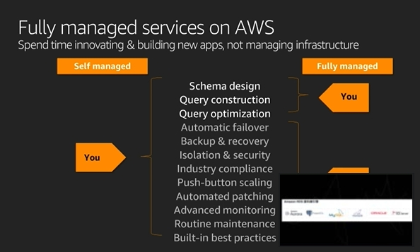
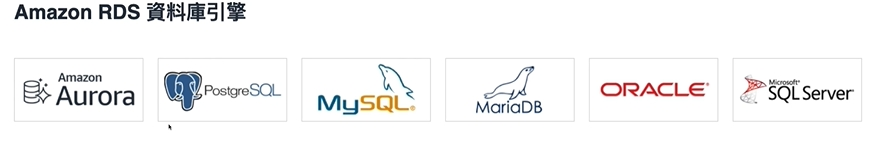
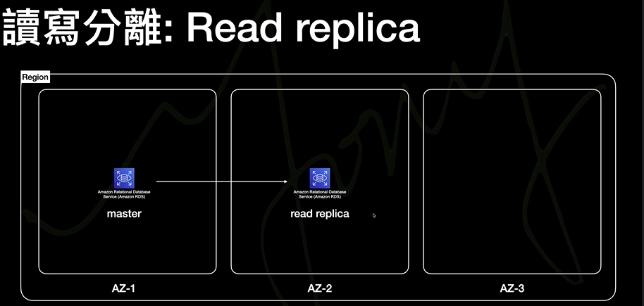
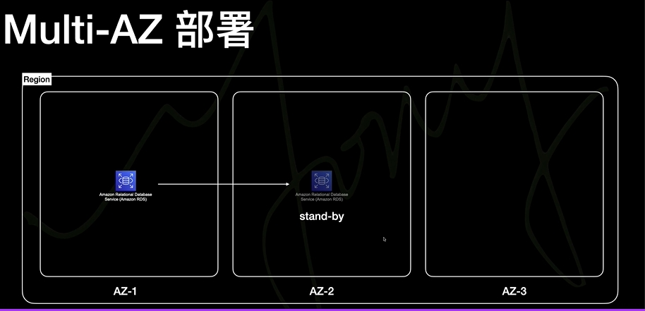

# Amazon RDS(Relational Database Service)

- RDS is the database that we need to put our data on the website when deploy in AWS.
- RDS 是網站於 AWS 存放資料庫的地方

# Key :

- 1.RDS 建置時 under 在 VPC 之下可避免外部資料存取的可能性, 並藉由 EC2 去跟 RDS 互動
- 2.RDS is fully-Manage(DB Engine | OS | Hardware) 皆由 AWS 管理, But the most important things is RDS complete divide with instance,
  so even through the instances is terminated, the data in RDS still exist.
- 3.Show self-manage v.s fully-manage(RDS handle db)
  - 
- 4.Automate Snapshot :
  - Automate back-up the data, and data-restoration via snapshot(可自動備份資料, 並可經由 snapshot 還原)
    
  - Read and Write(POS) divide (讀寫分離功能, 分流資料庫, 將使用者讀寫功能區分開來)
    
  - multi-AZ : The stand-by database(隨時備著的 db, 主 db 若壞掉將直接接手)
    
